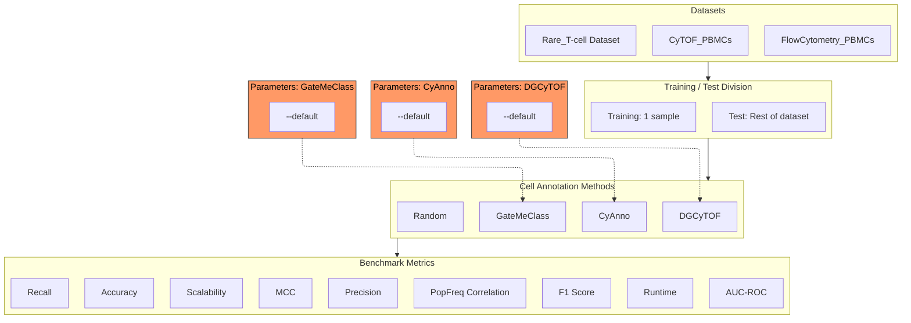

# OmniBenchmark Pipeline for CyTOF data

The ob-pipeline-cytof enables transparent, reproducible, and objective benchmarking of cytometry cell-type annotation methods using four carefully curated gold-standard datasets. It was created to simplify tool evaluation and ensure developers can confidently assess and communicate the performance of their methods.

)

## TODO

[] Reimplement metrics generation repo
[] Define python and R environments
[] Set up individual repos for each of the tools to be tested

---

## Table of Contents

- [Overview](#overview)
- [Key Features](#key-features)
- [Architecture](#architecture)
- [Gold standard datasets](#Gold-standard-datasets)
- [Selected tools](#Selected-tools)
- [Requirements for new tools](#Requirements-for-new-tools)
- [Repository Structure for New Tools](#Repository-Structure-for-New-Tools)
- [Installation](#installation)
- [Quick Start](#quick-start)
- [Configuration](#configuration)
- [Inputs & Outputs](#inputs--outputs)
- [Monitoring, Logs & Outputs Layout](#monitoring-logs--outputs-layout)
- [Testing & Quality](#testing--quality)
- [Troubleshooting](#troubleshooting)
- [FAQ](#faq)
- [Contributing](#contributing)
- [Versioning & Release Process](#versioning--release-process)
- [Citation](#citation)
- [License](#license)
- [Contact](#contact)

---

## Overview

The purpose of this benchmark is to evaluate computational tools that perform cell type annotation on cytometry data, with the initial focus placed on flow cytometry and CyTOF data.
Currently, manual gating relies on inspecting one- or two-marker plots to identify cell populations. This approach is widely used but it is subjective, depends heavily on the analyst’s experience, and often lacks reproducibility across users, laboratories, and experiments. As datasets grow larger and more complex, these limitations become more prominent.
A range of automatic and semi-automatic methods has been developed to address these issues. They aim to improve the consistency, objectivity, and scalability of cytometry data analysis. This benchmark aims to assess how well these tools achieve those goals.
The outcome of this work will provide a clearer understanding of the capabilities and limitations of current annotation tools and will help guide researchers in selecting the most appropriate methods for their analysis needs.

---

## Key Features

- 🔁 **End-to-end benchmarking workflow for evaluating cytometry cell-type annotation tools from raw input data to final performance reports.**
- 📦 **Modular and extensible design, allowing easy integration of new methods with minimal configuration.**
- 🧪 **Reproducible execution built on the Omnibenchmark framework and a Snakemake-based workflow.** 
- 🧬 **Four curated gold-standard datasets representing the key scenarios in which annotation tools are typically applied.**
- 📊 **Automated performance evaluation and reporting, including standardized metrics, comparison tables and visual summaries.**
- 🧩 **Simple tool onboarding, requiring only a GitHub-hosted repository and adherence to a minimal input/output structure.**
- ☁️ **Workflow engine and dependency management**: `<Omnibenchmark - Snakemake / Conda>`
- 💡 **Main language**: `<Python / R >`

---

## Architecture

## Gold Standard Datasets

All datasets included in this benchmarking workflow are **expert-annotated**:  
ground-truth labels were generated through **manual gating**, ensuring high-quality reference populations for evaluating automated cell-type annotation tools.

The benchmark includes three complementary, publicly available datasets that together cover a wide range of biological settings, technologies, and annotation challenges.

---

### **FR-FCM-Z367 — COVID CyTOF (CyTOF Whole Blood / PBMCs)**  
**Type:** CyTOF  
**Source:** FlowRepository ID [FR-FCM-Z367](http://flowrepository.org/id/FR-FCM-Z367)  
**Related publication:** https://pmc.ncbi.nlm.nih.gov/articles/PMC7963480/

**What it is:**  
A mass cytometry dataset generated from COVID-19 patient and healthy control samples, including whole blood and PBMCs profiled using high-dimensional CyTOF panels.

**Why it is included:**  
- Highly disease-relevant and clinically meaningful  
- Contains multiple samples, enabling robust cross-sample evaluation  
- Used in peer-reviewed literature, making it well-known and widely referenced  
- Includes rich immunophenotyping panels covering major immune lineages (T cells, B cells, myeloid populations)  
- Despite its low MiFlowCyt score, it is suitable for benchmarking because the missing metadata is **not required** for this pipeline  

This dataset provides a realistic test case for tool performance in **complex immune responses and clinical samples**.

---

### **FR-FCM-Z2KP — COVID-19 Immune Phenotyping (Flow Cytometry)**  
**Type:** Flow Cytometry  
**Source:** FlowRepository ID FR-FCM-Z2KP  
**Related publication:** https://www.ncbi.nlm.nih.gov/pmc/articles/PMC9951775/

**What it is:**  
A multiparameter flow cytometry dataset from COVID-19 patients and healthy controls, with high-resolution phenotyping of major and minor T-cell subsets, B cells, monocytes, and regulatory populations.

**Why it is included:**  
- Disease-relevant, multi-sample human PBMC dataset  
- Manually gated ground truth for major immune lineages  
- 16-marker panel enables detailed phenotyping  
- FlowSOM subdivision reveals deep cellular structure, including:  
  - ≈17 CD4⁺ conventional T-cell clusters  
  - 14 CD4⁺ regulatory T-cell clusters  
  - 17 CD8⁺ T-cell clusters  
  - Rare IL-10⁺ Tregs  
- Excellent benchmark for evaluating how well annotation tools detect **fine-grained subpopulations** and **rare subsets**

This dataset is particularly strong for evaluating methods that aim to distinguish subtle T-cell states and rare regulatory phenotypes.

---

### **Mosmann_rare — Rare Activated T-Cell Population (Flow Cytometry)**  
**Type:** Flow Cytometry (14 markers: 7 surface + 7 signaling)  
**Source:** Bioconductor (Mosmann rare PBMC dataset)

**What it is:**  
A human PBMC dataset stimulated with influenza antigens, designed specifically to assess a method’s ability to detect **rare cell populations**.

**Why it is included:**  
- Contains one extremely rare activated CD4 memory T-cell population  
- Only **109 gated positive cells out of ~396,000 total**  
- Ideal for benchmarking sensitivity and rare-event detection  
- Useful for assessing whether an annotation tool can avoid collapsing rare populations into larger neighboring clusters  

This dataset provides a stringent test for evaluating robustness and sensitivity in the low-frequency regime.

---

## Requirements for new tools

To add a new cell-type annotation tool to the pipeline, your implementation must satisfy the following requirements:

### 1. Host the tool in a public GitHub repository
Your tool must be accessible through a GitHub URL so the pipeline can automatically download and execute it at a fixed commit for reproducibility.

### 2. Ensure the tool accepts the standardized pipeline inputs

Each tool must be able to read the following files:

#### **Data matrix (`*.matrix.gz`)**
- Rows represent **cells**
- Columns represent **markers/features**
- Values contain **expression intensities**
- File is tab-separated and compressed (`.gz`)

#### **True labels (`*.true_labels.gz`)**
- Contains the reference/ground-truth cell-type for each cell
- One label per row
- Row order must correspond *exactly* to the matrix file

Your tool should not modify the input structure and must be able to load these files directly.

### 3. Ensure the tool outputs predictions in the correct format

Your tool must generate a file with:

- One **predicted label per cell**
- The same cell ordering as the input matrix
- File name following pipeline conventions:

## Repository Structure for New Tools

To ensure compatibility with the pipeline, your tool's GitHub repository should follow a simple and consistent structure. Below is a recommended layout:

my-tool-repo/
├── environment.yml # Conda environment describing tool dependencies
├── main.py # Main script that loads data, runs the method, writes predictions
├── utils/ # (Optional) Helper functions or modules
├── README.md # Usage instructions
└── LICENSE # Open-source license (recommended)

## Selected Tools

To ensure a robust, reproducible, and scalable benchmarking framework, we systematically evaluated a range of cell-type annotation tools and assessed their suitability for inclusion in the pipeline. Each candidate tool was reviewed according to predefined **inclusion** and **exclusion** criteria, with a focus on reproducibility, automation, documentation quality, and compatibility with CyTOF data.

### Inclusion Criteria
Tools were considered suitable for the benchmark if they fulfilled the following:

1. **Compatibility with CyTOF datasets**  
   Accepts standard formats such as `.csv`, `.txt`, `.rds`, or similar.

2. **Runnable on the Hetzner computational server**  
   No GUI-only tools; must execute autonomously in an HPC or Linux environment.

3. **Well documented**  
   Contains clear installation instructions, usage examples, and reproducible workflows.

4. **Implemented in R or Python**  
   Ensures long-term sustainability and straightforward integration into the Omnibenchmark framework.

5. **Autonomous execution**  
   Does not require manual decisions during runtime (e.g., user-driven gating or interactive Shiny interfaces).

6. **Conforms to expected I/O formats**  
   Can ingest a matrix + true labels and return predicted labels in the required structure.

### Exclusion Criteria
Tools were excluded if they met one or more of the following:

- **Not maintained** (last GitHub commit older than 5 years)  
- **Not implemented in R or Python**  
- **GUI-dependent** (e.g., Shiny-only tools)  
- **Insufficient documentation** preventing reproducible execution  
- **No support for standardized input/output formats**

---

## Overview of Evaluated Tools

The table below summarizes the tools we considered and how they scored relative to the inclusion criteria.

| Tool | Updated in last 5 yrs | Runs on Hetzner | Well Documented | R/Python Based | Autonomous | Compatible I/O | Included |
|------|------------------------|------------------|------------------|----------------|------------|----------------|----------|
| **CyAnno** | Yes | Yes | Yes | Yes | Yes | Yes | **Yes** |
| **GateMeClass** | Yes | Yes | Yes | Yes | Yes | Yes | **Yes** |
| **DGCytof** | Yes | Yes | Yes | Yes | Yes | Yes | **Yes** |
| **CyCadas** | Yes | Partially (Shiny) | Partially | Yes | No | Yes | **No** |
| **Spectre** | Yes | Yes | Yes | Yes | No | No | **No** |
| **SCINA** | Yes | Yes | Yes | Yes | No | No | **No** |
| **MetaCyto** | No | Yes | No | Yes | No | Yes | **No** |
| **DIY Random** | – | Yes | Yes | Yes | Yes | Yes | **Yes** |

---

## Final Tool Selection

After applying the full evaluation pipeline, the following tools were selected for inclusion in the benchmark:

- **CyAnno**  
- **GateMeClass**  
- **DGCytof**  
- **DIY Random classifier** (custom baseline)

These tools met all inclusion criteria, offered reliable automation, and produced predictions in the expected format, enabling seamless integration into the Omnibenchmark workflow.

The remaining tools—**CyCadas**, **Spectre**, **SCINA**, and **MetaCyto**—were excluded because they did not fully satisfy one or more requirements such as automation, documentation quality, maintenance status, or compatibility with standardized input/output formats.

---
